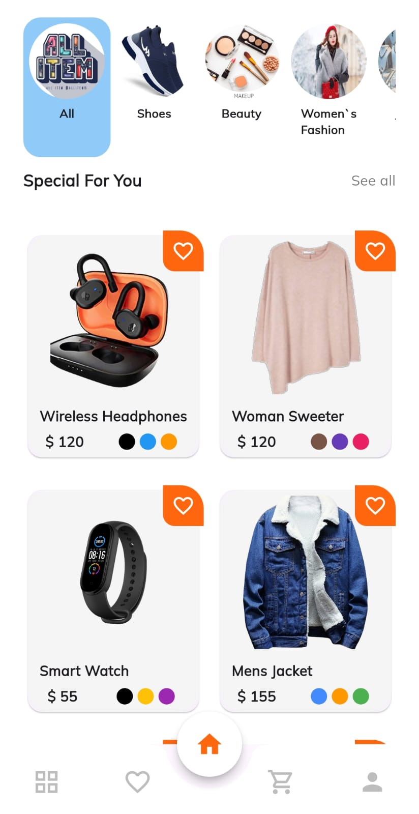
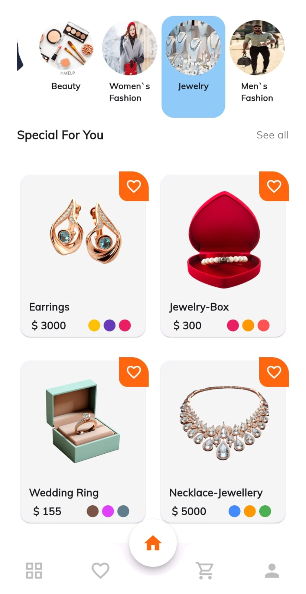
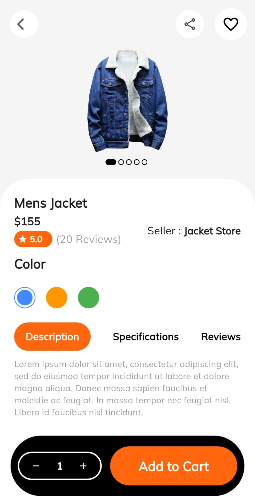
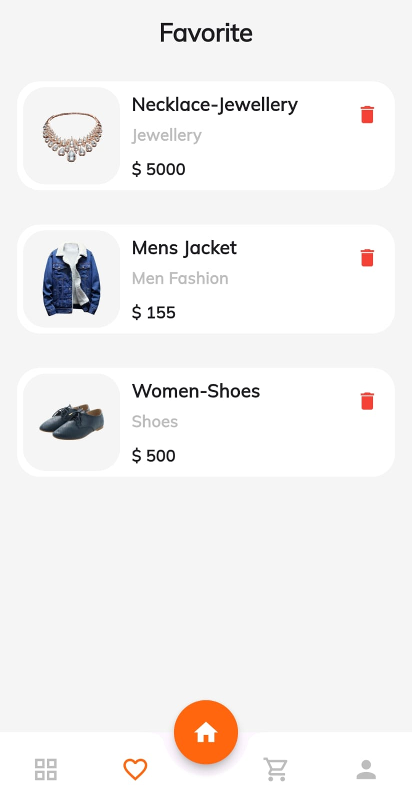
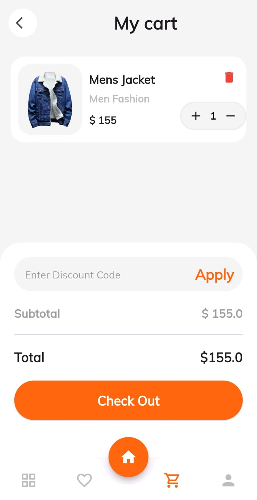

# 🛍️ Flutter E-Commerce App

A modern and visually appealing e-commerce mobile application built using **Flutter**. This project features a complete shopping experience, including product listing, categories, detail views, favorites, and a shopping cart.

## 📱 Screenshots

| Home                               | All Products | Categories |
|------------------------------------|--------------|------------|
|  |  |  |

| Product Detail | Favorites | Cart |
|----------------|-----------|------|
|  |  |  |

---

## 🚀 Features

- 🏠 Home screen with featured items and categories
- 🛒 Add to Cart functionality
- ❤️ Add/Remove Favorites
- 📦 Product detail page with full descriptions
- 🔍 Browse all products and filter by category
- 🎯 Responsive UI for different screen sizes
- 💾 Local state management (can be upgraded with Provider, GetX, or Bloc)

---

## 🧰 Tech Stack

- Flutter
- Dart
- State Management: Provider
- Local persistence: Shared Preferences

